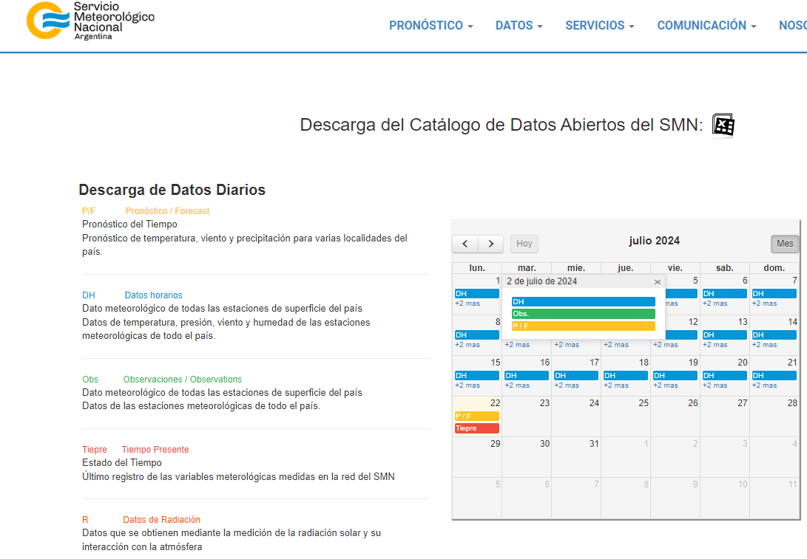
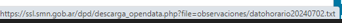

```{r setup, include=FALSE}
knitr::opts_chunk$set(echo = TRUE)

```

## Funciones de scrapeo

La idea de este breve artículo es mostrar una función para descargar datos desde el sitio del Servicio Meteorológico Nacional [SMN](https://www.smn.gob.ar/) y ,al mismo tiempo, entrenar el uso de funciones y bucles para un fin determinado.

# Ideas

En la sección [Descarga del Catálogo de Datos Abiertos del SMN](https://www.smn.gob.ar/descarga-de-datos) y luego de dar conformidad al acuerdo, es posible acceder a los datos diarios que el servicio pone a disposición, tal cual se ve en la siguiente imágen:

```{r echo=FALSE, out.width = "30%", fig.align = "center"}

```

Puede apreciarse todos los tipos de datos que brinda el sitio. A los fines de este artículo, optaremos por descargar los datos horarios (DF) a los cuales es posible acceder "clickeando" en el día buscado. Se puede ver que el enlace que lleva a la descarga del dato contiene su fecha:

```{r echo=FALSE, out.width = "30%", fig.align = "center"}

```

Por lo tanto, si lo que buscamos es efectuar varias descargas (por ejemplo todo un mes de observaciones) es necesario generar un objeto fecha que contenga los días buscados para automatizar las descargas mediante un bucle.

# Objetivo

**Generar un data frame que contenga las temperaturas mínimas y máximas de cada día junto con el valor de humedad promedio**

Arranquemos!

# Limpieza e instalación de librerías

```{r message=FALSE, warning=FALSE}

#se borran todos los objetos de la memoria

rm(list =ls())

#Se instalan librerías de trabajo

library(tidyverse) # Para limpieza y manipulación de datos
library(lubridate) # Para trabajar con fechas

setwd("C:/Users/Guille/Documents/Proyectos/WebScrapping/clima/Scrap_smn")

```

# Pensando la función

En este ejemplo vamos a intentar descargar observaciones desde el 01-07-2023 hasta el 31-07-2023 en la Ciudad Autónoma de Buenos Aires. Cada información diaria descargada contiene la información por hora y por observatorio. Vamos a tomar los primeros 24 valores correspondientes al observatorio de Aeroparque. Vamos a definir los objetos `fecha_inicial` y `fecha_final` para generar una secuencia de fechas a las que, finalmente, limpiaremos para que queden con el formato del link de descarga

```{r message=FALSE, warning=FALSE}

fecha_inicial <- ymd("2023-07-01")
fecha_final <- ymd("2023-07-31")

fechas <- seq.Date(fecha_inicial,fecha_final, by = "day") #aux para crear listado de fechas
list <- paste0(substr(fechas,1,4),substr(fechas,6,7),substr(fechas,9,10)) #lista que servirá de insumo para iterar

```

Ya tenemos nuestra lista, ahora vamos pensar un bucle for que itere los elementos de la misma con el objetivo de descargar la información y devolver un data frame, pero antes generamos un df vacío llamado dataclima en donde incorporaremos nuestras descargas:

```{r message=TRUE, warning=FALSE}

dataclima <- data.frame()

for (i in list){
  linkday <- glue::glue("https://ssl.smn.gob.ar/dpd/descarga_opendata.php?file=observaciones/datohorario{i}.txt") #link para descargar con la variable fecha
  day <- read.table(linkday, skip = 2, nrows = 24) #tabla con los datos descargados, se especifican las 23 primeras filas porque son las que corresponden a CABA
  dataclima <- rbind(dataclima,day) #se suman las filas diarias
  print(glue::glue("Fecha: {i}")) #a modo de control, se imprime las fechas de descagas
  print(glue::glue("se descargaron {nrow(dataclima)} datos"))
}

```

Ya tenemos nuestro df con las observaciones, veamos que contiene

```{r message=TRUE, warning=FALSE}

summary(dataclima)
glimpse(dataclima)

```

Dado que decidimos esquivar las primeras filas para no obtener errores, no sabemos los nombres de las columnas, Vamos a descargar solamente un día para obtener el nombre d de las variables.

```{r message=FALSE, warning=FALSE}

linkprueba <- glue::glue("https://ssl.smn.gob.ar/dpd/descarga_opendata.php?file=observaciones/datohorario20240702.txt") #link para descargar con la variable fecha
  
dayprueba <- read.table(linkprueba,nrows = 1)

dayprueba

```

Ya tenemos los nombres y podemos ver toda la información que brinda el smn en la modalidad datos horarios. A los fines de cumplir con el objetivo planteado. Vamos a crear un dataframe tomando el día como unidad y captando la temperatura máxima, la mínima y la media de humedad.

```{r message=FALSE, warning=FALSE}

df <- dataclima %>% 
  select(Fecha = V1,
         Hora = V2,
         Temp = V3,
         Humedad = V4) %>% 
  group_by(Fecha) %>% 
  summarise(Temp_Min = min(Temp),
            Temp_Max = max(Temp),
            Humedad_Media = round(mean(Humedad),2)) %>% 
  mutate(Fecha = dmy(Fecha)) %>% 
  arrange(Fecha)

df 

```

Vamos a graficar nuestros datos, para lo cual procedemos a pivotear la tabla

```{r message=FALSE, warning=FALSE}

library(ggtext)

tabla1 <- df %>% 
  pivot_longer(cols = c(Temp_Min,Temp_Max,Humedad_Media),
               names_to = "Variables",
               values_to = "Valores") 

ggplot(tabla1, aes(x = Fecha, y = Valores, color = Variables))+
  geom_line()+
  geom_point()+
  scale_color_manual(values = c("Temp_Min" = "#118ab2",
                                "Temp_Max" = "#ef476f",
                                "Humedad_Media" = "#122c91"))+
  labs(title = "Valores climáticos del mes de julio-2023 de<br><b style='color:#122c91;'>Humedad</b>, <b style='color:#ef476f;'>Temperatura Máxima</b> y <b style='color:#118ab2;'>Temperatura Mínima</b>",
       caption = "<b>Fuente</b>: Servicio Meteorológico Nacional")+
  theme_minimal()+
  theme(legend.position = "none", 
        panel.grid.minor = element_blank(),
        plot.title = element_markdown(margin=margin(0,0,10,-30), 
                                      size=12),
        plot.caption = element_markdown(size = 11))


```
